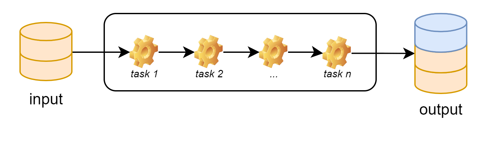
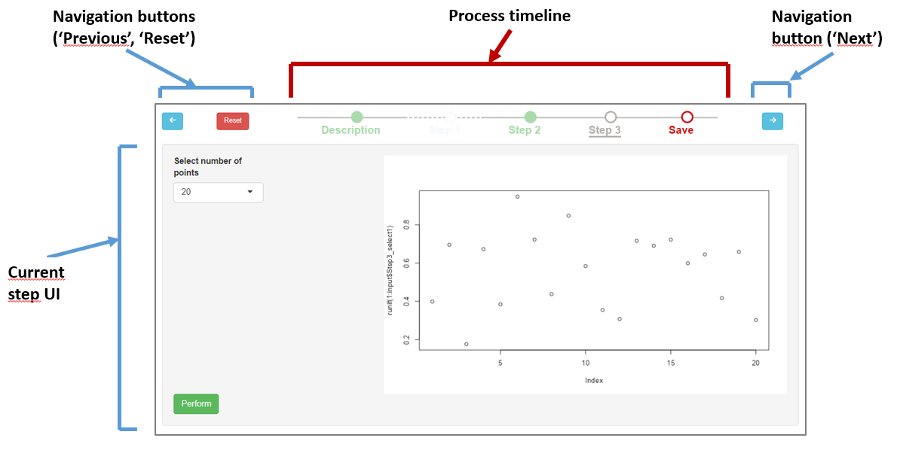
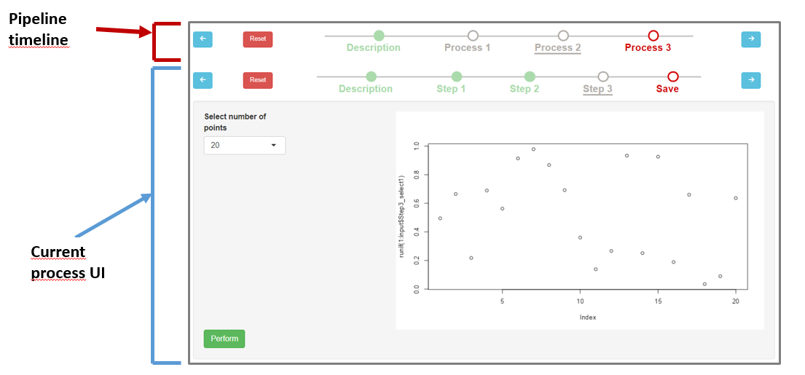

\newcommand{\shellcmd}[1]{\\\indent\indent\texttt{\footnotesize\# #1}}

\newcommand{\Rcmd}[1]{\\\indent\indent\texttt{\footnotesize\# #1}}

\newcommand{\bordurefigure}[1]{\fbox{\includegraphics{#1}}}

# Introduction

This package contains the core engine to instantiate a workflow manager
and provide an infrastructure for the configuration, the execution and
the surveillance of a defined sequence of tasks.

The audience of this document is end-users and describes the user
interface and the functionnality of the core engine. Please note that,
as a Shiny module, MagellanNTK can be run standalone or embebbed in
another Shiny module, as it is the case with

In order to have a more complete view of how MagellanNTK works or if you
intent to develop workflows or pipelines for MagellanNTK, it is advised
to see the xxx.

Generally, end users will not have to know much about `MagellanNTK`
other than the use of UI. This is the topic of this vignette. This is
why there is no installation nor technical section in his document. For
technical details, please refer to the vignette 'Configure MagellanNTK'

The graphical elements are mainly navigation elements which permit to
navigate between steps of a process or processes of a pipeline.

# Workflow overview

As a workflow manager, the aim of `MagellanNTK` is to execute a series
of ordered tasks over a dataset.

At high level, it can be view as a black box with two communication
channels (input and output). A dataset is passed to the engine which
performs actions on it and return a new dataset. The role of
MagellantNTK is to organize and adapt the succession of actions that
will be performed on the dataset. For example, some steps can be
skipped, other are mandatory and cannot be skipped...



## Single task

As said, a workflow is a series of actions (steps)

In MagellanNTK, a task (or step) is defined as a data processing program
that performs a minimal and consistent set of basic operations on a
dataset. It cannot be divided into subtasks.

A basic workflow execute all the tasks in their predefined order. But,
even if the global direction is always one-way, it can be interesting to
introduce some rules to customize the effective execution of the set of
tasks. Fro example, a given task may be facultative (eventually under
some condition) while another one will be mandatory. The implementation
of such possibilities is made by mean of properties on tasks.

To this end, task are tagged with a few properties. Two tags determine
the state of a task:

| Tag     | Values       | Description                                                                                                 |
|------------------|--------------------|-----------------------------------|
| Done    | true / false | Indicates whether a task has been executed                                                                  |
| Skipped | true / false | Indicates whether a task has been skipped (i.e. there is at least one task further that has been validated) |

One property refines the possibilities of a task:

| Name      | Values       | Description                                                                   |
|-----------|--------------|-------------------------------------------------------------------------------|
| Mandatory | true / false | Indicates whether a task must be executed to be able to pursuie the workflow. |

In real life, tasks are identified by a combination of tags and
properties. Different styles are used to identify them

However, the first and the last steps of a process (respectively called
'Description' and 'Save') are always mandatory and are added by
\`MagellanNTK \* *skipped*. A step can be facultative and may be skipped
without any consequences on the execution of the other steps.

MagellanNTK associates a UI (as a Shiny module) to each task. For a view
of styles used to the bullets w.r.t the state of the step, please refer
to Annex 1

## Process

The series of steps (actions) executed on a dataset in a predefined
order is called a process. The set of steps is consistent with a more
complex computation than the singles steps.

With `MagellanNTK`, two mandatory. steps are automatically added:
'Description' and 'Save'. In addition, a process have at least one step
and can have as many as needed.

A *(processing) step* is the minimal thing that operates a data program
on a dataset. It is built with a UI which can contains widgets (to
define parameters values), plots, etc. In short, a step cannot be
divided into multiple steps. Concretely, a process is implemented as a
Shiny module. For more details on how to build a process module, see
xxx.

```{r 'processOverview', results='markup', fig.cap="Process overview", echo=FALSE, out.width='100%', fig.align='center', fig.wide = TRUE}
knitr::include_graphics("./figs/process.png", error = FALSE)
```

Any process transforms its input dataset to produce a new dataset at
output. In terms of structure, that means that the object given as input
has *n* items (datasets) and has *n+1* items (datasets) at the end of
the process. Thus, at any time, the object keeps the entire history of
what happened to datasets.

## Pipeline

The engine's architecture in `MagellanNTK` is implemented in a recursive
way. Thus, it can be seen as a hierarchical tree where each nodes and
leaves correspond respectively to processes and steps.

A pipeline is defined as a process but in which each step is an entire
process, not a single step. As it, it is composed of a series of steps
but here, each step is a process (as defined above). `MagellanNTK` is a
recursive engine and can manage several levels of processes

As shown in xxx, a pipeline is at third level of such a structure.

```{r 'hierarchyWorkflow', results='markup', fig.cap="Process overview", echo=FALSE, out.width='100%', fig.align='center', fig.wide = TRUE}
knitr::include_graphics("./figs/pipeline.png", error = FALSE)
```

As a pipeline is also a workflow, one have globally the same behaviour
for the dataset. Thus, the object at the output of a pipeline has on
more dataset than the dataset passed at the input.

## Data formats

\`MagellanNTK\` is compliant with objects with a list structure. One
defines here as dataset, a list composed of at least one sub-dataset. By
default, the first sub-dataset is called 'original'.

As we will see along this document, the object manipulated by
MagellanNTK is a list of datasets.

The minimal object possible has one dataset (generally names 'original')

## Rules

Rules are applied here to guarantee that the global strategy of the
workflow in MagellanNTK are followed.

**One way**. The deroulement is in one way. Tasks are executed from the
first towards the last. It is not possible de go back or rerun a task
that has already been validated (exception if reset, see xxx).

A task may be run only if the previous one has been done. this ensures
to execute the set of tasks in one direction. It is not possible to
return to a task already done. Each task can be run once.

Those UI are developed by the creator of the process w.r.t. some
guidelines (See xxx). In particular, each step has of 'Validate' button
which save the dataset in the state it is at that time. Once the steps
has been validated, it status pass from 'Undone' to 'Done. Graphically,
this is visible with the bullet which become full rather than empty.

```{r 'steps', results='markup', fig.cap="Three steps in the workflow", echo=FALSE, out.width='100%', fig.align='center', fig.wide = TRUE} knitr::include_graphics("./figs/steps.png", error = FALSE)}
```

# User interface

The interface depends on the complexity of the structure. The minimal UI
is about process workflow (two-levels structure). But as said
previously, xxxx. The same principles are the same for upper level
complexity.

This is why this section mainly focus on the process workflow to explain
how it works. Describing more complex structures will be easier.

## Timeline

In this schema, the steps are represented by bullets linked by lines. At
any time, the current step is marked with an underline below the name of
the step.

The style of bullets varies w.r.t. some conditions. The table below
describes the possible styles. There are explained in more details in
the section xxx

In the timelines, steps are identified by bullets linked by line. The
style of both bullets and line gives an information about the state of
the corresponding step.

The table below describes the different styles and their meaning

|                  Bullet                  |   Property    |  State   | Done/Undone |
|:----------------------------------------:|:-------------:|:--------:|:-----------:|
|  |    Skipped    | Disabled |   Undone    |
|   |   Mandatory   | Disabled |   Undone    |
|    |   Mandatory   | Enabled  |   Undone    |
|  |      \-       | Disabled |    Done     |
|  | Not mandatory |          |   Undone    |

## Navigation commands

Three buttons are available to interact with the whole current step and
navigate through the different steps of the process.

The **Prev** button (on the left) changes the current step to set the
previous one. This button is enabled only if there is at least one step
backward.

Similarly, the **Next** button (on the right) changes the current step
to set the next one on the timeline. This button is enabled only if
there is at least one step forwards.

The **Reset** button sets all the widgets of the process to their
default value. It is enabled only if the process is not validated yet.
The current step is also set to the first one.

The behaviour of the timeline used in the general workflow is similar in
many points to the data processing modules

The 'Next' and 'Previous' buttons can be enabled or disabled w.r.t the
current position. They are enabled if it is possible to go in their
direction

Note that the 'Reset' button is always enabled.

## Rules

A step at rank *n* is enabled if:

-   the previous step (*n-1*) is validated

-   or if another previous (*\<n-1*) step is validated and there is no
    mandatory and undone steps between them. This ensure that the
    mandatory step will be validated

It is always possible to navigate between all the steps event if they
are disabled. This feature is useful if one wants to see/discover the
content of next steps or to remind the values set in the previous
widgets.

## Interface for processes

In this section, one describes how a workflow is implemented in
MagellanNTK First, let's discover the general UI (see xxx). The UI is
divided in three regions, as showed on xxx. In this example, one view
the workflow for a process (called 'Process1') which contains 4 steps
named respectively 'Description', 'Step1', 'Step2, 'Save'. The first and
last steps are common to all workflows managed by `MagellanNTK` while
the steps 'Step1' and 'Step2' are specific to the workflow.

-   the area called **Timeline** represent the actions defined in the
    process, placed in the order they might be executed. It is the
    representation of the set of steps composing the process

-   The area called **Navigation commands** contains the navigation
    buttons ('Next, 'Previous' and 'Reset') that allow to pass from a
    step to another one (changing the current step)

-   the region **Main UI** is the place where the content of each step
    of the workflow is displayed.

This place shows the content of the current step. Depending on which
actions are allowed at current time, the widgets used to interact with
the interface may be enabled or disabled. This depends of the state of
the process and is explained in details in section xxx.

The state of the bullet in the timeline for a given step determines the
state of the widgets in the corresponding UI. It means that if the
bullet of a step is enabled then all the widgets of this step are
enabled (the Perform button also). In the contrary, a bullet that is
disabled means that all the widgets and the 'Perform' button in the UI
are disabled



The interface for each step contains at least one button named
'Perform'. This is the mean to validate a step. Th evalidatin of a step
leads to different actions in the UI, especially a change in the status
of bullets and other steps.

-   A process cannot be run several times on the same dataset. To avoid
    that, a process be run on the previous result of itself.

## Interface for pipelines

In the case of a pipeline, a second pipeline is needed to navigate
between processes. Thus, in xxx, is figured the UI of a pipeline with
the additional timeline.



Note that in a pipeline timeline, the first step is still 'Description'
but there is not more step called 'Save' as it is the case for any
process timeline. The reason is because it is not necessary due to the
fact that a 'Save' step exists in the last process.

Thus, when the user save its work in the last process of the pipeline,
this will automatically save the whole object and return it to the
caller program.

# Process workflow

This section aims at describing how to use the workflow UI when
processing a dataset. The goal is not to describe the different data
processing tools available but to explain the behaviour of the user
interface of what we call 'MagellanNTK core'. One focus here on the
level of processes. To remind, a process is composed in steps which are
direct actions (steps) on the dataset.

To run this use case while reading explanations, type the following
command in a R console:

``` R
library(MagellanNTK)
demo_workflow()
```

**Launching the workflow**

When the user launches the workflow manager, it comes with the first
Step called 'Description'. At this time, all the other steps are
disabled until the user validate the current step. This ensure that the
dataset is correctly passed to the first step. By default, a workflow
work on the last dataset of the object. Thus, if this object contains
several datasets, the last one is loaded.


At this step, only the 'Description' step is enabled (see the style of
the bullet and the button 'Start'). The other steps (timeline) are
disabled. However, it is possible to view the content of the other
steps.


**Validating the 'Description' step**

Here, the user has clicked on the 'Start' button (contented in the ui of
'Description' step). The bullet has changed to take the style of 'Done'
steps.


The validation of the step (same behavior for all steps) has two main
consequences:

-   The current step ( here 'Description') becomes disabled (all its
    widgets disabled). This is to avoid any additional action from the
    user inside this step

-   The forwarding steps may potentially be enabled but this must
    respect the rule (See xxx). In this case, the steps 'Step 1' and
    'Step 2' are enabled but not the step 'Save' because it is placed
    after a non-validated mandatory step.

The user switch to 'Step 1' by clicking on the 'Next' button.

The 'Step 1' is now the current step (note the underline that means it
is now the current step). As it is enabled, all its widgets are enabled.


In this use case, on gonna skip this step. For this, the user go to the
next step ('Step 2') by clicking on the 'Next' button.

The user set the widgets to the value he wants and then validate his
choices by clicking on the button 'Perform'. Once done, the entire step
become disabled and the bullet's style is changing to "Done".


One the widgets are set to their custom value, the user validate the
step by clicking on the 'Perform' button. The changes are:

-   As for all current steps, the entire interface switch to a disabled
    state,

-   the bullet changes to the style of Validated steps

-   the next steps become enabled. In this case, there is only one last
    step ('Save')

-   the style of bullets for previous steps is updated if necessary. It
    is the case for 'Step 1' which has been skipped

Note: A step is really skipped only if it has not been validated and a
further one is validated. That means that one can begin to modify the
widgets in a step *n*. If the user do not validate it and go to another
step (*\>n*), then the values of the step *n* will be forgotten.

If one go back to the previous step (the one we have skipped), we can
see a blue area which informs the user that this step has been skipped
(it has been disabled even with no validation).


**Saving workflow result**

The last step has been enabled by the validation of the previous step.
The user can now save its work by clicking on the 'Save' button. This
will result in sending th new dataset (processed by this workflow) to
the program which has called it.


To ensure consistency in workflow, each step has some properties which
are used to drive the workflow. Note that here, one look at a given
level and steps can be processes if we are at the level of pipeline.

the resulting new item is appended to the list of items.

To remind, the object get at this step has one more dataset than the one
given at the beginning.

A process cannot be run more than one time on the same item. To avoid
that a process be run on the previous result of itself.

**Reset a process**

The button 'Reset' allows to set back the workflow in its default state
(the same state as when the user launches the workflow). At any time, it
is possible to reset the workflow; A popup warns the user of the
effects.


Then, if the reset is done, one return to the initial state of the
workflow (see fig..)

About the dataset. Two differents things appears whether the Reset
button is clicked:

-   **Reset is clicked after the user has validated the whole process**.
    That means that the object has one more dataset (the one that has
    been calculated during the process). In this case, a click on the
    Reset button delete the last dataset in the object so as to return
    to the same object as vefore.

-   **Reset is clicked whenever during the workflow (which is not
    validated yet)**. In a process workflow, there is no engine to save
    the object at each step of the workflow. That means that during the
    workflow, the initial object has no changes (changes are made in a
    temporary object). Thus, if a Reset occurs at this time, it happens
    nothing to the object.

# Pipeline workflow

**Launch a pipeline**

When laucnhing a pipeline workflow, two timelines appear (their style -
vertical or horizontal - depends of the parameters used). The upper one
is dedicated to the steps (each one is a process) of the pipeline while
the down one stands for the steps of the process.

Note that the process called 'Description' of a pipeline does not have
any steps besides a Description one. This is an exception to the rule
that any process have at least one real step.


When using a pipeline level, there are two timelines and therefore, two
'Reset' Buttons: one for the pipeline itself and one for the processes

**Resetting a process**

If the Reset button of a process is clicked, that affects only the
current process. The behavior is the same as for processes (See xxx).
The current step becomes the first one (Description), all the widgets
are set to their default values and are disabled. The current process is
still the same

**Resetting a pipeline**

If the Reset button of a pipeline is clicked, this will set back the
entire pipeline to its default values. The object is set back to the
beginning, i.e. all the datasets added by the processes are deleted. In
the pipeline's timeline, the first sptep ('Description') becomes the
current one.

If the user goes backward on a previous step and validate this step,
then the following steps are automatically set to 'undone' and have to
be rerun. This guarantees that the steps are always done in the same
way. This feature must be implemented in each module source code. It
cannot be coded in the navigation module (recursive loop on the listener
of isDone vector)

# Reprocess a dataset

Suppose i = N and p = P (from the standard workflow). The user can
change the current item of the dataset (WHAT'S ITS GOAL ?????)

-   i \< N (the current item is not the last one of the dataset): Two
    cases has to be distinguished:
    -   p = P ((the current process is the last process of the
        workflow): xxx \* p \< P (the current process is not the last
        one of the workflow): xxx

        ```         
           In both cases, one delete all the items of the dataset from i+1 to N then the new item (produced by the process) is appended to the dataset list. 

           At the end of this sequence, the current indices must return to their normal values (i = N, p = P). That means that the real workflow has been modified by the user but the final workflow is like the standard one

           ### 

           * a l'affichage de l'UI d'un processus déjà exécuté auparavant:
        ```

    -   si l'indice courant i est positionné sur le dernier élément du
        dataset, alors affichage du début du processus, \* si i est
        positionné sur un dataset précédent (i \< N) (le dataset déjà
        traité par ce processus), alors on n'affiche que la dernière
        page du processus

# Session information

```{r}
sessionInfo()
```

workflow
