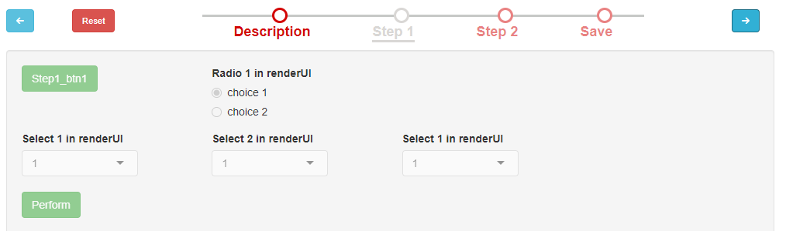
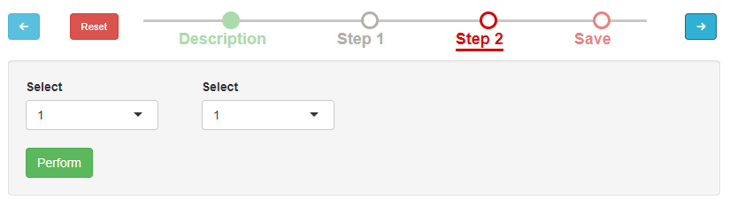
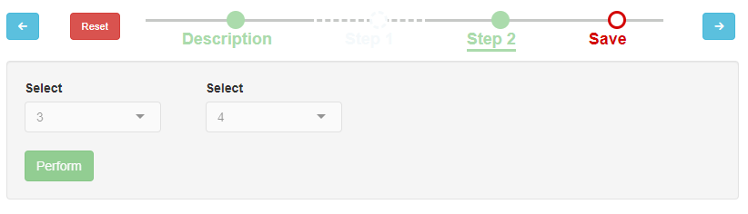

\newcommand{\shellcmd}[1]{\\\indent\indent\texttt{\footnotesize\# #1}}

\newcommand{\Rcmd}[1]{\\\indent\indent\texttt{\footnotesize\# #1}}

\newcommand{\bordurefigure}[1]{\fbox{\includegraphics{#1}}}

# Introduction

This package contains functions that consist in core engine. A workflow
manager provides an infrastructure for the configuration, the execution
and the surveillance of a defined sequence of tasks.

This document covers the use of the interface from the user point of
view. Please note that, as a Shiny module, MagellanNTK can be run
standalone or embebbed in another Shiny module, as it is the case with

In order to have a more complete view of how MagellanNTK works or if you
intent to develop workflows or pipelines for MagellanNTK, it is advised
to see the xxx.

One key feature of the engine provided by `MagellanNTK` is its
flexibility

Generally, end users will not have to know much about `MagellanNTK`
other than the use of UI. This is the topic of this vignette. This is
why there is no installation nor launching section about this package.
For those details, please refer to the vignette 'Configure MagellanNTK'

The graphical elements are mainly navigation elements which permit to
navigate between steps of a process or processes of a pipeline

# A quick workflow tutorial

As a workflow manager, the aim of the engine provided by `MagellanNTK`
is to execute a series of actions over a dataset and in a particular
order.

At high level, it can be considered as a black box with two
communication channels (input and output). A dataset is passed to the
engine which performs actions on it and then return a new dataset. The
role of MagellantNTK is to organize and adapt the succession of actions
that will be performed on the dataset. For example, some steps can be
skipped, other are mandatory and cannot be skipped...

The actions managed by the engine are implemented as Shiny modules. A
configuration file to indicate where to find the modules to display.

Hierarchical and ordered workflow structure

## Basic wokflow

As said, a workflow is a series of actions (steps)

In MagellanNTK, one defines a *step* as a data processing program that
performs a 'single' action on a dataset. Typically, a step cannot be
divided into smaller parts.

One can consider this graph as an automate.

Typical properties of an action are: \* *status* (or state): Done or
undone \* *mandatory* In a process, any step may be mandatory or not,
that depends on what the developer of the process have decided. However,
the first and the last steps of a process (respectively called
'Description' and 'Save') are always mandatory and are added by
\`MagellanNTK \* *skipped*. A step can be facultative and may be skipped
without any consequences on the execution of the other steps.

Each step allow the display of the corresponding UI. Those UI are
developed by the creator of the process w.r.t. some guidelines (See
xxx). In particular, each step has of 'Validate' button which save the
dataset in the state it is at that time. Once the steps has been
validated, it status pass from 'Undone' to 'Done. Graphically, this is
visible with the bullet which become full rather than empty.

```{r 'steps', results='markup', fig.cap="Three steps in the workflow", echo=FALSE, out.width='100%', fig.align='center', fig.wide = TRUE}
knitr::include_graphics("./figs/steps.png", error = FALSE)
```

For a view of styles used to the bullets w.r.t the state of the step,
please refer to Annex 1

## Process

A *process* is a series of steps (actions) executed on a dataset in a
predefined order. The set of steps is consistent with a more complex
computation than the singles steps.

With `MagellanNTK`, two mandatory. steps are automatically added:
'Description' and 'Save'. In addition, a process have at least one step
and can have as many as needed.

A *(processing) step* is the minimal thing that operates a data program
on a dataset. It is built with a UI which can contains widgets (to
define parameters values), plots, etc. In short, a step cannot be
divided into multiple steps. Concretely, a process is implemented as a
Shiny module. For more details on how to build a process module, see
xxx.

```{r 'processOverview', results='markup', fig.cap="Process overview", echo=FALSE, out.width='100%', fig.align='center', fig.wide = TRUE}
knitr::include_graphics("./figs/process.png", error = FALSE)
```

## Pipeline

The engine's architecture in `MagellanNTK` is implemented in a recursive
way. Thus, it can be seen as a hierarchical tree where each nodes and
leaves correspond respectively to processes and steps.

A pipeline is defined as a process but in which each step is an entire
process, not a single step. As it, it is composed of a series of steps
but here, each step is a process (as defined above). `MagellanNTK` is a
recursive engine and can manage several levels of processes

As shown in xxx, a pipeline is at third level of such a structure.

```{r 'hierarchyWorkflow', results='markup', fig.cap="Process overview", echo=FALSE, out.width='100%', fig.align='center', fig.wide = TRUE}
knitr::include_graphics("./figs/pipeline.png", error = FALSE)
```

# Describing the UI

The interface depends on the complexity of the structure. The minimal UI
is about process workflow (two-levels structure). But as said
previously, xxxx. The same principles are the same for upper level
complexity.

This is why this section mainly focus on the process workflow to explain
how it works. Describing more complex structures will be easier.

## Process UI

In this section, one describes how a workflow is implemented in
MagellanNTK First, let's discover the general UI (see xxx). The UI is
divided in three regions, as showed on xxx. In this example, one view
the workflow for a process (called 'Process1') which contains 4 steps
named respectively 'Description', 'Step1', 'Step2, 'Save'. The first and
last steps are common to all workflows managed by `MagellanNTK` while
the steps 'Step1' and 'Step2' are specific to the workflow.

```{r 'generalOverview_tlh', results='markup', fig.cap="Overview of the MagellanNTK user interface", echo=FALSE, out.width='100%', fig.align='center', fig.wide = TRUE}
knitr::include_graphics("./figs/run_workflow_empty_dataset_tlh_withFrame.png", error = FALSE)
```

```{r 'generalOverview_tlv', results='markup', fig.cap="Overview of the MagellanNTK user interface", echo=FALSE, out.width='100%', fig.align='center', fig.wide = TRUE}
knitr::include_graphics("./figs/run_workflow_empty_dataset_tlv.png", error = FALSE)
```

-   the area called **Timeline** represent the actions defined in the
    process, placed in the order they might be executed. It is the
    representation of the set of steps composing the process
-   The area called **Navigation commands** contains the navigation
    buttons ('Next, 'Previous' and 'Reset') that allow to pass from a
    step to another one (changing the current step)
-   the region **Main UI** is the place where the content of each step
    of the workflow is displayed.

### Main UI

This place shows the content of the current step. Depending on which
actions are allowed at current time, the widgets used to interact with
the interface may be enabled or disabled. This depends of the state of
the process and is explained in details in section xxx.

The state of the bullet in the timeline for a given step determines the
state of the widgets in the corresponding UI. It means that if the
bullet of a step is enabled then all the widgets of this step are
enabled (the Perform button also). In the contrary, a bullet that is
disabled means that all the widgets and the 'Perform' button in the UI
are disabled

The interface for each step contains at least one button named
'Perform'. This is the mean to validate a step. Th evalidatin of a step
leads to different actions in the UI, especially a change in the status
of bullets and other steps.

### Navigation commands

Three buttons are available to interact with the whole current step and
navigate through the different steps of the process.

The **Prev** button (on the left) changes the current step to set the
previous one. This button is enabled only if there is at least one step
backward.

Similarly, the **Next** button (on the right) changes the current step
to set the next one on the timeline. This button is enabled only if
there is at least one step forwards.

The **Reset** button sets all the widgets of the process to their
default value. It is enabled only if the process is not validated yet.
The current step is also set to the first one.

### Timeline

In this schema, the steps are represented by bullets linked by lines. At
any time, the current step is marked with an underline below the name of
the step.

The style of bullets varies w.r.t. some conditions. The table below
describes the possible styles. There are explained in more details in
the section xxx

In the timelines, steps are identified by bullets linked by line. The
style of both bullets and line gives an information about the state of
the corresponding step.

The table below describes the different styles and their meaning

|                  Bullet                  |   Property    |  State   | Done/Undone |
|:----------------------------------------:|:-------------:|:--------:|:-----------:|
|  |    Skipped    | Disabled |   Undone    |
|   |   Mandatory   | Disabled |   Undone    |
|    |   Mandatory   | Enabled  |   Undone    |
|  |      \-       | Disabled |    Done     |
|  | Not mandatory |          |   Undone    |

## General rules about steps

The behaviour of the timeline used in the general workflow is similar in
many points to the data processing modules

The 'next'and 'previous' buttons can be enabled or disabled w.r.t the
current position. They are enabled if

it is possible to go in their direction

Note that the 'Reset' button is always enabled.

A step at rank *n* is enabled if:

-   the previous step (*n-1*) is validated

-   or if another previous (*\<n-1*) step is validated and there is no
    mandatory and undone steps between them. This ensure that the
    mandatory step will be validated

It is always possible to navigate between all the steps event if they
are disabled. This feature is useful if one wants to see/discover the
content of next steps or to remind the values set in the previous
widgets.

## Pipeline UI

In the case of a pipeline, a second pipeline is needed to navigate
between processes. Thus, in xxx, is figured the UI of a pipeline with
the additional timeline.

# Use case

This section aims at describing how to use the workflow UI when
processing a dataset. The goal is not to describe the different data
processing tools available but to explain the behaviour of the user
interface of what we call 'MagellanNTK core'. One focus here on the
level of processes. To remind, a process is composed in steps which are
direct actions (steps) on the dataset.

To run this use case while reading explanations, type the following
command in a R console:

``` R
library(MagellanNTK)
demo_workflow()
```

## Launching the workflow

When the user launches the workflow manager, it runs with the first Step
called 'Description'. At this time, all the other steps are disabled
until the user validate the current step. This ensure that the dataset
is correctly passed to the first step.


At this step, only the 'Description' step is enabled (see the style of
the bullet and the button 'Start'). The other steps (timeline) are
disabled.

One discover the different properties of the steps with their bullet:
the step 2 is not mandatory while the steps 3 and 'Save' are. None of
the steps are validated yet (empty bullets).



## Validating the 'Description' step

Here, the user has clicked on the 'Start' button (contented in the ui of
'Description' step).


This action has the follolling effects:

-   The current step ('Description') becomes disabled (all widgets
    disabled) to avoid any additional action from the user

-   The next steps may become enabled but this must respect the rule
    (See xxx). Thus, steps 1 and 2 are enabled but not the step 'Save'
    because it is placed after a undone mandatory step.

The user switch to 'Step 1' by clicking on the 'Next' button.

## Change to 'Step1'

One then view the interface of the Step 1 (note the underline that means
it is now the current step).



The user set the widgets to the value he wants and then validate his
choices by clicking on the button 'Perform'. Once done, the entire step
become disabled and the bullet's style is changing to "Done".



As said previously, a workflow execute actions in a predefined order. In
general, once a step is done, tye user go to the next one until the last
one

So as to facilitate the use of the UI, MagellanNTK has implemented a few
rules:

To ensure consistency in workflow, each step has some properties which
are used to drive the workflow. Note that here, one look at a given
level and steps can be processes if we are at the level of pipeline.

# UI overview

A workflow is defined as a series of operations

## Timelines and navigation buttons

A "timeline" is the reThe timelines implemented in Prostar have the
following characteristics:

-   a main centered part which displays the timeline with
    steps/processes which composed the object workflow,
-   a 'reset' button to reset the current workflow
-   two buttons 'next' and 'previous' to navigate in the timeline

The effects of each button will be discussed in the sections related to
workflows and processing modules.

## Data processing modules

As we see previously, a data processing module is a unit of treatment
which takes an object (list of n datasets) as input and return an object
(list of n+1 datasets). It is composed of one or more steps, each step
using the result of a previous step. Thus, the basic behaviour of a
processing module is very similar to the workflow: data processing is
straightforward. Steps are also tagged mandatory or not and can be
skipped if they are not.

At the end of each processing module, the user have to validate it. By
this action, it creates the final dataset, adds it to the object
received in input and returns it

### Timeline features

## Content of steps

UI Each process UI is composed of one or more screens which correspond
to the different steps of the process. The navigation between each
screen is realized by means of buttons placed on the right and the left
of the navigation UI (the 'timeline').

The timeline may take different aspects w.r.t the style applied. The
principle is to have

Several buttons are available: \* the buttons 'Prev' (on the left) and
'Next' 'on the right' are always part of the timeline. AT the
initialization of the process, only the 'Next' button is visible and
disabled

## Logics for processes and datasets

Here are the different rules that exists in Prostar core to deal with
the different transactions between data processing modules and the
dataset. The UI of Prostar allows the user to navigate between those two
lists so as to rerun a process, fix a mistake in its parameters. But, to
guarantee that the workflow stay consistent with the
objective/philosophy of Prostar, some rules are implemented.

Each data processing modules and dataset can be seen as a list of
respectively P and N items. Let i, p be the indices of respectively the
current item in the dataset list and the current item in the process
list of the workflow.

The different combination of values for i and p (their relative
position) determines the behaviour of datasets and processes regarding
the general philosophy of Prostar.

Without any action of the user on the current item nor process, Prostar
follows the standard workflow:

-   At the beginning of Prostar, i = 1 = N and p = 1
-   after the run of any process p, i = N = p -1 (the process has
    produced a new item in the dataset)

The user may change either the current item in the dataset or the
current process to be run. This leads to several situations.

### Default (standard) behaviour

-   The default behaviour one have to see at the end of the execution of
    the workflow is that it seems to has gone straightforwards in the
    process list. It means that each process p runs on the item i=N and
    generates a dataset of N+1 items. If next process to be run is p',
    then p' \> p.

-   By default, the behaviour of a module process is to work on the last
    item of the dataset; the resulting new item is appended to the list
    of items. Thus, by default, the current indice i is set to the last
    item of the dataset. For example, if the user starts the workflow
    with i = 1 (+ offset), p = 1, then at the end of the workflow, one
    must have i = N, p = P with N = P + 1 (+ offset)

-   A process cannot be run more than one time on the same item. To
    avoid that a process be run on the previous result of itself.

If the user goes backward on a previous step and validate this step,
then the following steps are automatically set to 'undone' and have to
be rerun. This guarantees that the steps are always done in the same
way. This feature must be implemented in each module source code. It
cannot be coded in the navigation module (recursive loop on the listener
of isDone vector)

### Timeline

But, the user may navigate differently in the process and dataset lists.
Thus, different situations may occur. Suppose we are after a standard
run, then p = P, i = N, i = p + 1

### Reprocess a previous item of the dataset

Suppose i = N and p = P (from the standard workflow). The user can
change the current item of the dataset (WHAT'S ITS GOAL ?????)

-   i \< N (the current item is not the last one of the dataset): Two
    cases has to be distinguished:
    -   p = P ((the current process is the last process of the
        workflow): xxx \* p \< P (the current process is not the last
        one of the workflow): xxx

        ```         
           In both cases, one delete all the items of the dataset from i+1 to N then the new item (produced by the process) is appended to the dataset list. 

           At the end of this sequence, the current indices must return to their normal values (i = N, p = P). That means that the real workflow has been modified by the user but the final workflow is like the standard one

           ### 

           * a l'affichage de l'UI d'un processus déjà exécuté auparavant:
        ```

    -   si l'indice courant i est positionné sur le dernier élément du
        dataset, alors affichage du début du processus, \* si i est
        positionné sur un dataset précédent (i \< N) (le dataset déjà
        traité par ce processus), alors on n'affiche que la dernière
        page du processus

# Annexes

## Styles for steps bullets

In the timelines, steps are identified by bullets linked by line. The
style of both bullets and line gives an information about the state of
the corresponding step.

# Session information

```{r}
sessionInfo()
```

workflow
